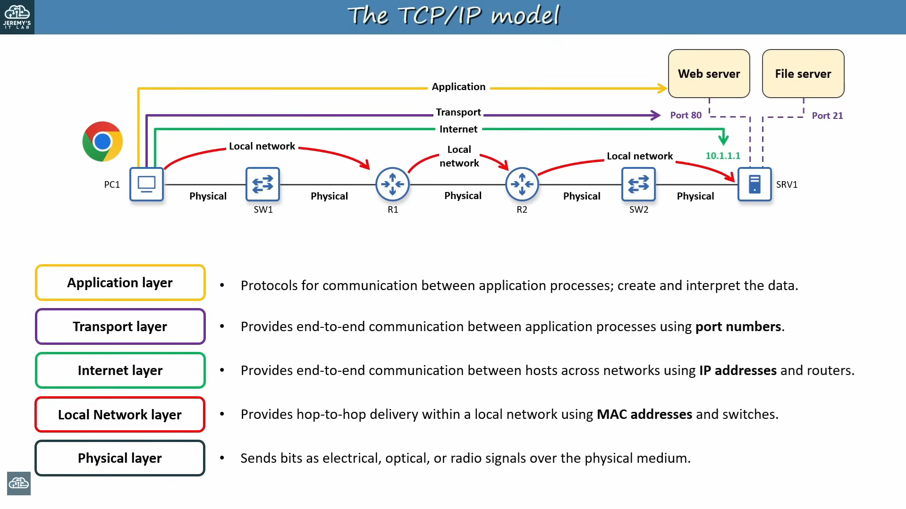
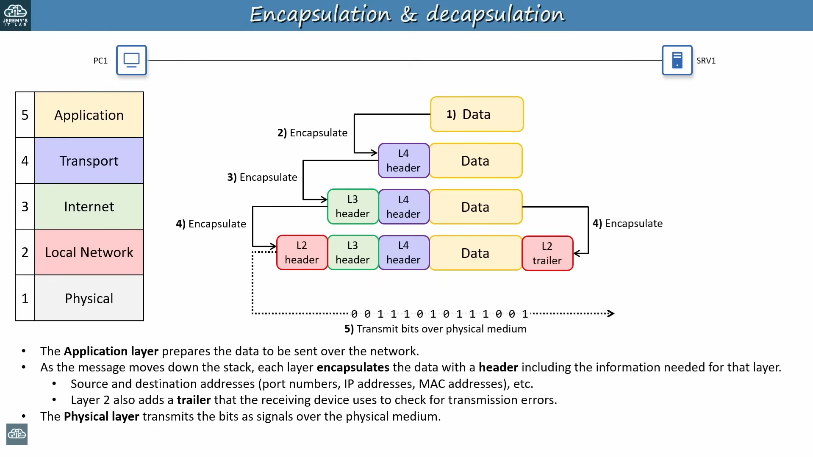
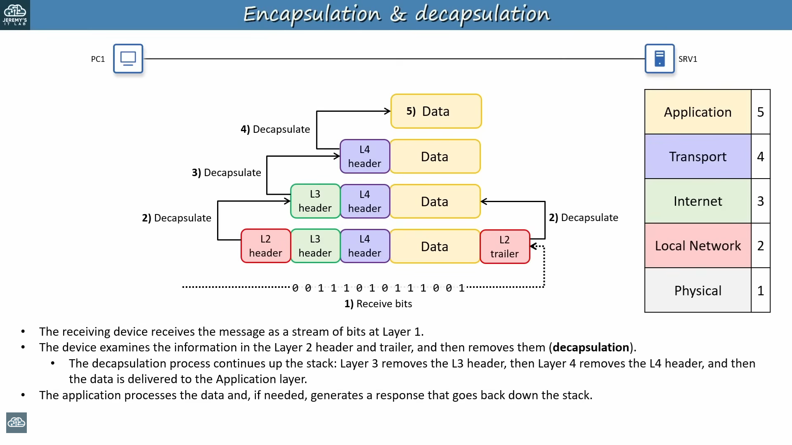
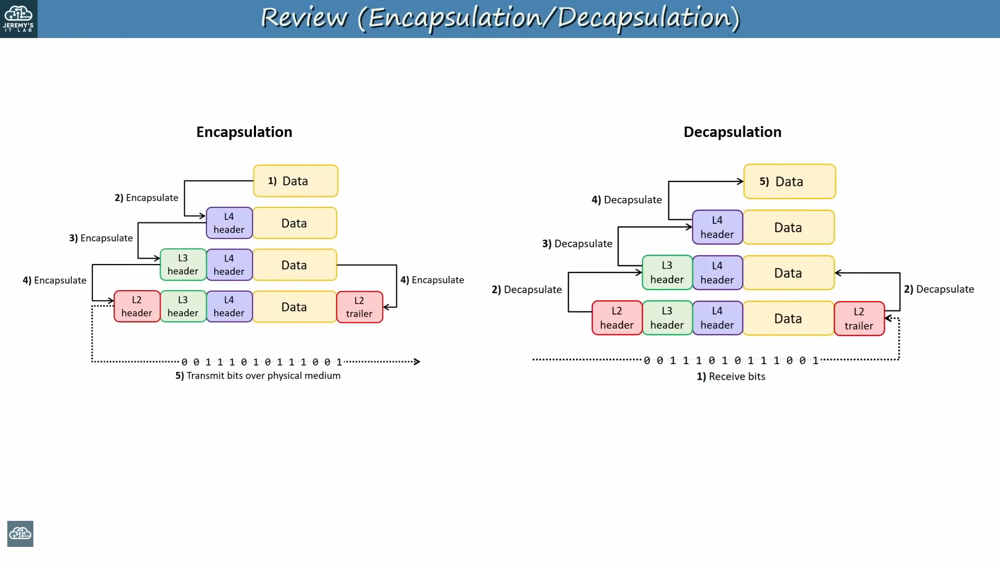
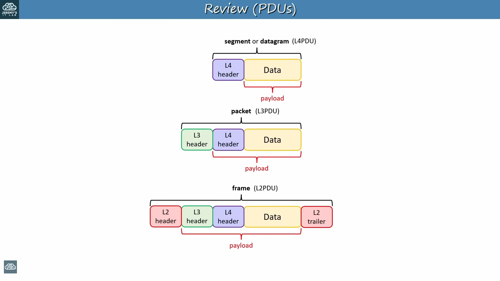
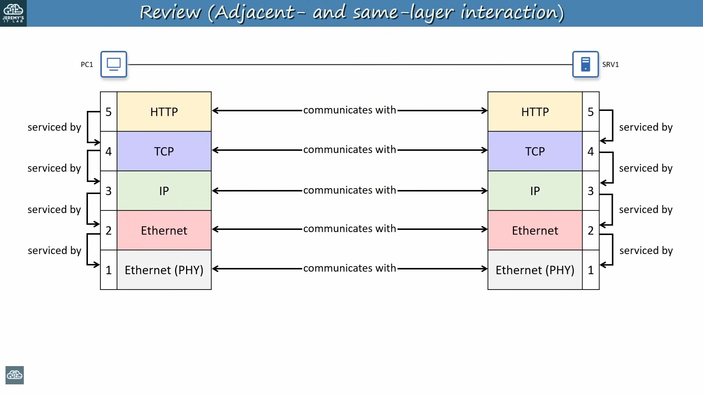
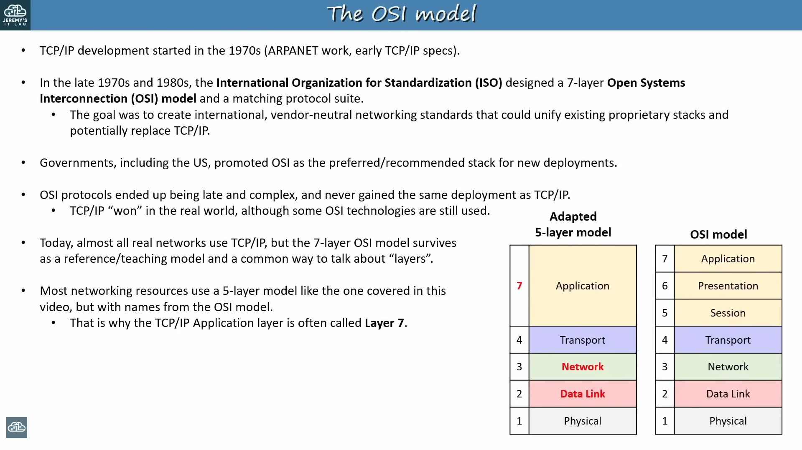
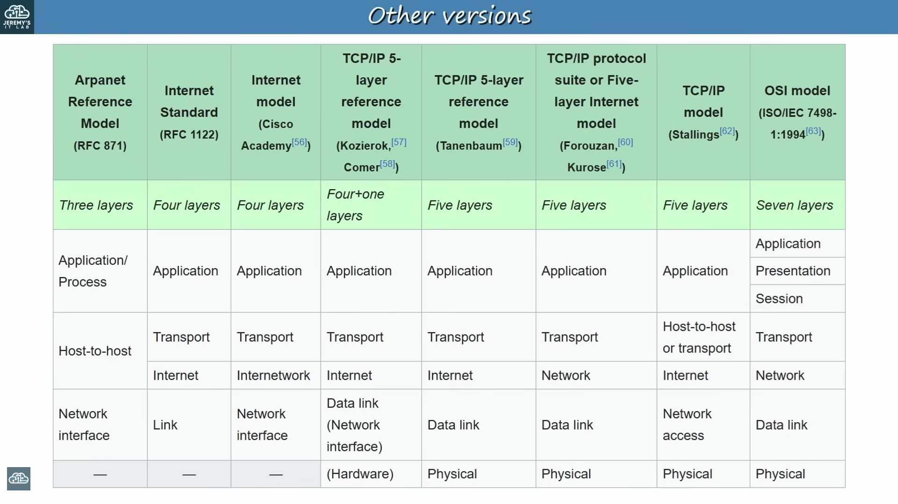

# 3. HOW THE TCP/IP & OSI MODELS ACTUALLY WORK (UPDATED)

> **Course Reference**: Jeremy's IT Lab CCNA 200-301 — [Day 3: How the TCP/IP Model Actually Works](https://youtu.be/yM-XNq9ADlI)  
> **Supplementary Materials**: `Day 03 Flashcards - TCP-IP.apkg` & `Day 03 Lab - OSI Model.pkt`

---

## What is a Networking Model?

A **networking model** (also known as a **network architecture**) categorizes and provides a structured framework for networking protocols and standards.

- **Protocol**: A set of logical rules defining how network devices and software communicate and exchange data (the "languages" computers speak).
- **Standard**: An agreed-upon, vendor-neutral specification that describes how a protocol or technology should work.

### Why Do We Need Protocols and Standards?

- Provide common communication standards across networks.
- Provide common hardware and software standards so devices from different vendors can interoperate.
- Prevent vendor lock-in (e.g., proprietary systems from the 1970s and 1980s where IBM mainframes could not talk to other vendors' systems).
- In modern networks, an Apple MacBook, a Windows PC, a Linux web server, and an Android smartphone can all communicate seamlessly because they follow the same open standards.

---

## A Bit of History: The Origins of TCP/IP

- **1960s**: The US Department of Defense's **ARPA** (Advanced Research Projects Agency) funded research into packet-switching networks.
- **1969**: **ARPANET** came online, connecting university and research laboratory mainframes across the United States.
- **NCP (Network Control Program)**: ARPANET's original communication protocol (prior to TCP/IP).
- **1974**: **Vint Cerf** and **Bob Kahn** (widely recognized as the "fathers of the Internet") began developing **TCP** (Transmission Control Program).
- **Split into TCP and IP**: TCP was later split into two separate, foundational protocols:
  - **TCP** (Transmission Control Protocol) — *the word "Program" was updated to "Protocol"*.
  - **IP** (Internet Protocol).
- **January 1, 1983**: ARPANET officially completed its migration from NCP to TCP/IP ("Flag Day"), establishing TCP/IP as the standard protocol suite of what became the global Internet.

---

## Who Defines the Standards?

Network standards are created and maintained by vendor-neutral international standards organizations:

| Organization                                                      | Scope & Focus                                                                                                | Key Standards / Documents                                                                                            |
|:----------------------------------------------------------------- |:------------------------------------------------------------------------------------------------------------ |:-------------------------------------------------------------------------------------------------------------------- |
| **IEEE** *(Institute of Electrical and Electronics Engineers)* | Defines standards for **Local Area Networks (LANs)**, physical media, cabling, and data-link specifications. | - **IEEE 802.3**: Ethernet (wired LANs) - **IEEE 802.11**: Wi-Fi (wireless LANs)                                  |
| **IETF** *(Internet Engineering Task Force)*                   | Defines open standards used on the **Internet** and across the TCP/IP protocol suite.                        | - Published as **RFCs** (*Requests for Comments*). Anyone can freely view, download, and study RFC documents online. |

---

## Why Use Layered Models?

Layered models break down the complex process of network communications into separate, distinct, and manageable layers.

### Key Benefits:

1. **Modularity**: Individual layers can be developed, optimized, or replaced without redesigning the entire network stack.
2. **Troubleshooting**: Engineers can isolate a problem to a specific layer (e.g., a physical cable issue vs. an IP routing issue).
3. **Vendor Interoperability**: Hardware and software from different manufacturers can work together seamlessly if they adhere to the interface standards between layers.
4. **Ease of Learning**: Understanding one focused layer at a time is far simpler than trying to comprehend the entire communication process at once.

### Real-World Analogy: Sending a Postal Letter

1. *Writing the letter*: The application / message content.
2. *Addressing & Packaging*: Writing source and destination addresses on an envelope.
3. *Postal Sorting*: Post office reads the destination address to route the letter through local and regional distribution hubs.
4. *Physical Delivery*: Trucks, planes, or couriers transport the physical envelope.

**Separation of Layers**: If the postal service switches from delivery vans to cargo planes, you do not have to rewrite the contents of your letter or change the language you wrote it in.

---

## The Modern 5-Layer TCP/IP Model

While the original TCP/IP model had 4 layers, modern networking and CCNA training primarily utilize the **5-Layer TCP/IP Model** because it clearly separates the Physical and Data Link functions.

### Device Layer Scope (As Shown in the Topology Above)

- **End Hosts (PC1, SRV1)**: Implement all **5 layers** (Application, Transport, Internet, Local Network, Physical).
- **Routers (R1, R2)**: Operate primarily up to **Layer 3** (Physical, Local Network, Internet) to inspect IP packets and make routing decisions.
- **Switches (SW1, SW2)**: Operate primarily up to **Layer 2** (Physical, Local Network) to forward frames based on MAC addresses.

---

### Layer 5 — APPLICATION

- **Function**: Provides network services to software applications running on the computer.
- **Role**: Creates and interprets the application data.
- **Key Protocols**: HTTP, HTTPS (web browsing), DNS (domain resolution), DHCP (automatic IP assignment), SSH (secure CLI management), FTP/TFTP (file transfer), SMTP/POP3/IMAP (email).
- *Note*: Often called **Layer 7** in everyday industry terminology due to the legacy OSI model.

---

### Layer 4 — TRANSPORT

- **Function**: Provides **end-to-end communication between application processes** running on different hosts.
- **Addressing**: Uses **Port Numbers** (e.g., port 80 for HTTP, port 443 for HTTPS, port 53 for DNS) to ensure data reaches the exact target application on the destination host.
- **Segmentation**: Breaks large application data blocks into smaller segments suitable for transmission.
- **Core Protocols**:
  - **TCP (Transmission Control Protocol)**: Connection-oriented, reliable, provides acknowledgments, sequence numbers, flow control, and error recovery.
  - **UDP (User Datagram Protocol)**: Connectionless, lightweight, fast, no acknowledgments or error recovery (ideal for real-time traffic like voice, video, and DNS queries).

---

### Layer 3 — INTERNET (Network Layer)

- **Function**: Provides **end-to-end communication between hosts across multiple interconnected networks** (routing and addressing).
- **Addressing**: Uses logical addressing: **IP Addresses** (IPv4 and IPv6).
- **Routing**: Determines the best path (path selection) to forward data from the source host to the destination host across interconnected networks.
- **Key Network Device**: **ROUTERS** operate at Layer 3.
- **Core Protocols**: IPv4, IPv6, ICMP, ARP (operates between L2/L3), OSPF, BGP.

---

### Layer 2 — LOCAL NETWORK (Data Link Layer)

- **Function**: Provides **delivery of data within the same local network** (hop-to-hop / node-to-node delivery).
- **Addressing**: Uses physical/hardware addressing: **MAC Addresses** (Media Access Control).
- **Framing**: Defines how data is packaged into frames to traverse a specific local physical medium (e.g., Ethernet or Wi-Fi).
- **Error Detection**: Adds a trailer containing a **FCS** (Frame Check Sequence) to detect transmission errors that occurred on the physical medium.
- **Key Network Device**: **SWITCHES** operate at Layer 2.

---

### Layer 1 — PHYSICAL

- **Function**: Defines the physical characteristics of the transmission medium used to send digital data between devices.
- **Role**: Transmits raw digital **bits** (0s and 1s) as electrical signals (copper UTP cables), optical pulses of light (fiber-optic cables), or radio waves (wireless / Wi-Fi).
- **Specifications**: Connectors (RJ-45, LC/SC fiber), voltage levels, pinouts, maximum cable lengths, signaling speeds.
- **Key Network Device**: **HUBS** and repeaters operate at Layer 1.

---

## Encapsulation and Decapsulation

Data exchange between network devices follows a strict process of encapsulation at the sender and decapsulation at the receiver.

### Encapsulation (Sender side: Top to Bottom)

1. **Step 1 — Application (L5)**: Prepares the data to be sent over the network.
2. **Step 2 — Transport (L4)**: Encapsulates the data with a **Layer 4 Header** (containing source and destination port numbers).
3. **Step 3 — Internet (L3)**: Encapsulates the L4 segment/datagram with a **Layer 3 Header** (containing source and destination IP addresses).
4. **Step 4 — Local Network (L2)**: Encapsulates the L3 packet with a **Layer 2 Header** (containing source and destination MAC addresses) and a **Layer 2 Trailer** (used by the receiving device to check for transmission errors).
5. **Step 5 — Physical (L1)**: Transmits the bits as electrical, optical, or radio signals over the physical medium.

---

### Decapsulation (Receiver side: Bottom to Top)

1. **Step 1 — Physical (L1)**: The receiving device receives the message as a stream of bits at Layer 1.
2. **Step 2 — Local Network (L2)**: Examines the information in the Layer 2 header and trailer. If no transmission errors are detected, it strips them (**decapsulation**) and passes the packet up to Layer 3.
3. **Step 3 — Internet (L3)**: Removes the Layer 3 header after verifying the destination IP address, and passes the segment up to Layer 4.
4. **Step 4 — Transport (L4)**: Removes the Layer 4 header after identifying the destination application port number, and delivers the data to the Application layer.
5. **Step 5 — Application (L5)**: The application processes the data and, if needed, generates a response that goes back down the stack.

---

### Encapsulation & Decapsulation Review (Side-by-Side)

---

## Protocol Data Units (PDUs) and Payloads

A **Protocol Data Unit (PDU)** is the formal name given to a data block defined at a specific layer:

### PDU Breakdown and Payload Relationships:

- **Segment or Datagram (L4PDU)**:
  - Consists of: `[L4 Header] + [Data]`
  - **Payload**: The application **Data**.
- **Packet (L3PDU)**:
  - Consists of: `[L3 Header] + [L4 Header + Data]`
  - **Payload**: The entire **L4PDU** (Segment or Datagram).
- **Frame (L2PDU)**:
  - Consists of: `[L2 Header] + [L3 Header + L4 Header + Data] + [L2 Trailer]`
  - **Payload**: The entire **L3PDU** (Packet).

| Layer #     | Layer Name                | PDU Name                               | Header/Trailer Added             | Primary Addressing                             |
|:-----------:|:------------------------- |:-------------------------------------- |:-------------------------------- |:---------------------------------------------- |
| **Layer 5** | Application               | **Data**                               | Application Message / Data       | N/A                                            |
| **Layer 4** | Transport                 | **Segment** (TCP) / **Datagram** (UDP) | Layer 4 Header                   | **Port Numbers** (Source & Destination)        |
| **Layer 3** | Internet / Network        | **Packet**                             | Layer 3 Header                   | **IP Addresses** (Source & Destination)        |
| **Layer 2** | Local Network / Data Link | **Frame**                              | Layer 2 Header + Layer 2 Trailer | **MAC Addresses** (Source & Destination) + FCS |
| **Layer 1** | Physical                  | **Bit**                                | Digital signals (0s and 1s)      | N/A                                            |

---

## Layer Interactions: Same-Layer vs. Adjacent-Layer

### 1. Adjacent-Layer Interaction ("Serviced By")

- Occurs **vertically on the same device**.
- A higher layer requests services from the layer directly below it, and the lower layer provides services to the layer directly above it.
- **Example**: On PC1, the Application layer (HTTP) is **serviced by** the Transport layer (TCP), which is **serviced by** the Internet layer (IP), which is **serviced by** the Local Network layer (Ethernet), which is **serviced by** the Physical layer (Ethernet PHY).

### 2. Same-Layer Interaction ("Communicates With")

- Occurs **horizontally between the matching layers on two different devices**.
- Communicating devices use headers to coordinate functions and establish virtual connections at each layer.
- **Example**:
  - The HTTP application on PC1 **communicates with** the HTTP server on SRV1.
  - The TCP layer on PC1 **communicates with** the TCP layer on SRV1 (tracking sequence numbers and acknowledgments).
  - The IP layer on PC1 **communicates with** the IP layer on SRV1 (using IP addressing).

### 3. Separation of Layers (Layer Independence)

- Changes made at one layer do not require changes at other layers.
- **Example**: If you disconnect your PC from a wired Ethernet cable (copper) and connect via Wi-Fi (radio waves), you have replaced Layer 1 and Layer 2. However, Layer 3 (IP configuration), Layer 4 (TCP connections), and Layer 5 (web browser tabs) continue working without modification.

---

## The OSI Model (7 Layers) & Industry Shorthand

The **OSI (Open Systems Interconnection) Model** was developed by the **ISO** (International Organization for Standardization). While TCP/IP became the protocol suite actually deployed across the global Internet, the OSI model remains the universal reference framework for networking terminology.

### Popular OSI Layer Mnemonics:

- **Top to Bottom (7 to 1)**:  
  **A**ll **P**eople **S**eem **T**o **N**eed **D**ata **P**rocessing  
  *(Application, Presentation, Session, Transport, Network, Data Link, Physical)*
- **Bottom to Top (1 to 7)**:  
  **P**lease **D**o **N**ot **T**hrow **S**ausage **P**izza **A**way  
  *(Physical, Data Link, Network, Transport, Session, Presentation, Application)*

### The Upper OSI Layers (6 and 5):

- **Layer 6 (Presentation)**: Translates data formats, character sets, data compression, and encryption.
- **Layer 5 (Session)**: Controls sessions and dialogues between communicating applications.
- *In TCP/IP*: Layers 5, 6, and 7 are all combined into the single **Application Layer**, handled by application software developers rather than the operating system kernel.

### Everyday Industry Terminology:

Network engineers use OSI layer numbers as standard technical shorthand:

- **"Layer 1 Issue"**: Physical cable, connector, transceiver, or electrical problem.
- **"Layer 2 Switch" / "Layer 2 Issue"**: Switching, VLANs, MAC address learning, or Spanning Tree Protocol (STP).
- **"Layer 3 Router" / "Layer 3 Routing"**: IP addressing, subnets, routing tables, default gateways.
- **"Layer 4 Port" / "Layer 4 Firewall"**: Filtering traffic based on TCP or UDP port numbers.
- **"Layer 7 Firewall" / "Layer 7 Inspection"**: Deep packet inspection examining application payloads (e.g., inspecting HTTP URLs, web application firewalls).

---

## Networking Models Comparison (Other Versions)

Over the years, various organizations and authors have published different versions and divisions of networking models:

---
